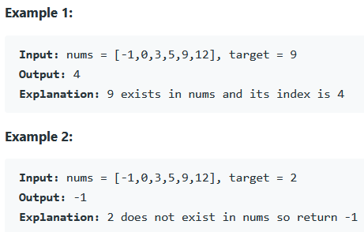

### REFERENCE
https://leetcode.com/problems/binary-search/

### task
Given an array of integers nums which is sorted in ascending order, and an integer target, write a function to search target in nums. If target exists, then return its index. Otherwise, return -1.
You must write an algorithm with O(log n) runtime complexity.

### Examples

### Constraints
* 1 <= nums.length <= 10^4
* -10^4 < nums[i], target < 10^4
* All the integers in nums are unique.
* nums is sorted in ascending order.
