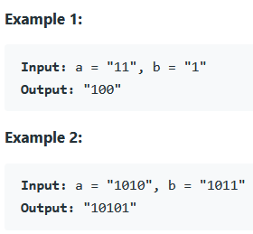

### REFERENCE
https://leetcode.com/problems/add-binary/

### task
Given two binary strings a and b, return their sum as a binary string.

### Examples

### Constraints
* 1 <= a.length, b.length <= 10^4
* a and b consist only of '0' or '1' characters.
* Each string does not contain leading zeros except for the zero itself.
