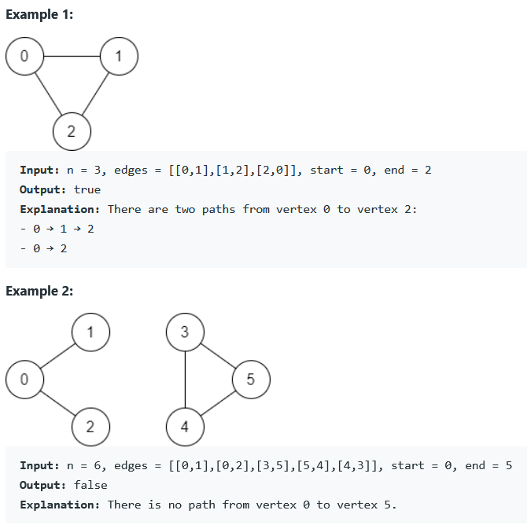

### REFERENCE
https://leetcode.com/problems/find-if-path-exists-in-graph/

### task
There is a bi-directional graph with n vertices, where each vertex is labeled from 0 to n - 1 (inclusive). The edges in the graph are represented as a 2D integer array edges, where each edges[i] = [ui, vi] denotes a bi-directional edge between vertex ui and vertex vi. Every vertex pair is connected by at most one edge, and no vertex has an edge to itself.  
You want to determine if there is a valid path that exists from vertex start to vertex end.  
Given edges and the integers n, start, and end, return true if there is a valid path from start to end, or false otherwise.

### Examples

### Constraints
* 1 <= n <= 2 * 10^5
* 0 <= edges.length <= 2 * 10^5
* edges[i].length == 2
* 0 <= ui, vi <= n - 1
* ui != vi
* 0 <= start, end <= n - 1
* There are no duplicate edges.
* There are no self edges.
