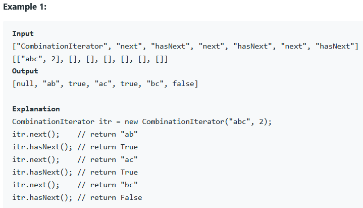

### REFERENCE
https://leetcode.com/problems/iterator-for-combination/

### task
Design the CombinationIterator class:  
* CombinationIterator(string characters, int combinationLength) Initializes the object with a string characters of sorted distinct lowercase English letters and a number combinationLength as arguments.  
* next() Returns the next combination of length combinationLength in lexicographical order.  
* hasNext() Returns true if and only if there exists a next combination.  

### Examples

### Constraints
* 1 <= combinationLength <= characters.length <= 15  
* All the characters of characters are unique.  
* At most 10^4 calls will be made to next and hasNext.  
* It is guaranteed that all calls of the function next are valid.  
