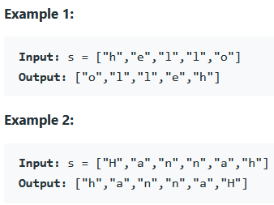

### REFERENCE
https://leetcode.com/problems/reverse-string/

### task
Write a function that reverses a string. The input string is given as an array of characters s.  
You must do this by modifying the input array in-place with O(1) extra memory  

### Examples

### Constraints
* 1 <= s.length <= 10^5
* s[i] is a printable ascii character.
