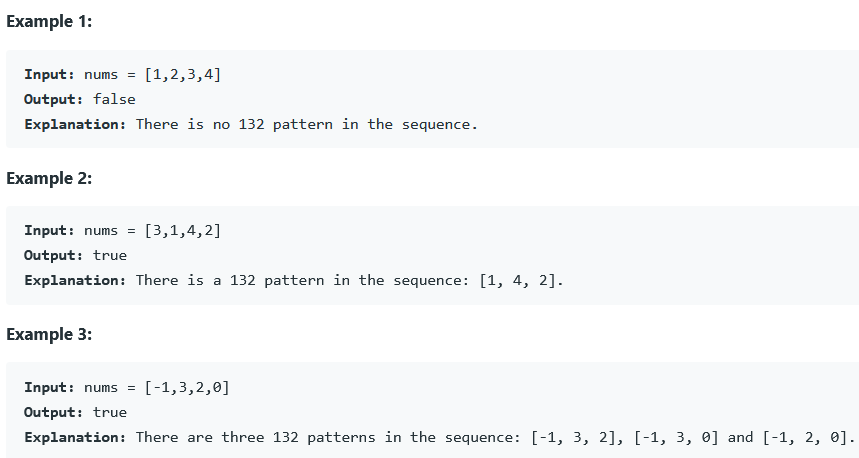

### REFERENCE
https://leetcode.com/problems/132-pattern

### task
Given an array of n integers nums, a 132 pattern is a subsequence of three integers nums[i], nums[j] and nums[k] such that i < j < k and nums[i] < nums[k] < nums[j].  
Return true if there is a 132 pattern in nums, otherwise, return false.  

### Examples

### Constraints
* n == nums.length
* 1 <= n <= 2 * 10^5
* -10^9 <= nums[i] <= 10^9
