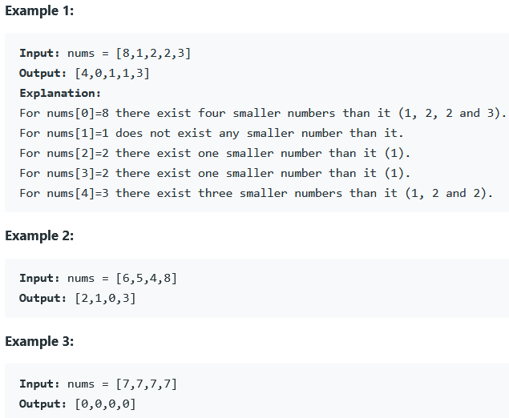

### REFERENCE
https://leetcode.com/problems/how-many-numbers-are-smaller-than-the-current-number/

### task
Given the array nums, for each nums[i] find out how many numbers in the array are smaller than it. That is, for each nums[i] you have to count the number of valid j's such that j != i and nums[j] < nums[i].  
Return the answer in an array.

### Examples

### Constraints
* 2 <= nums.length <= 500
* 0 <= nums[i] <= 100
