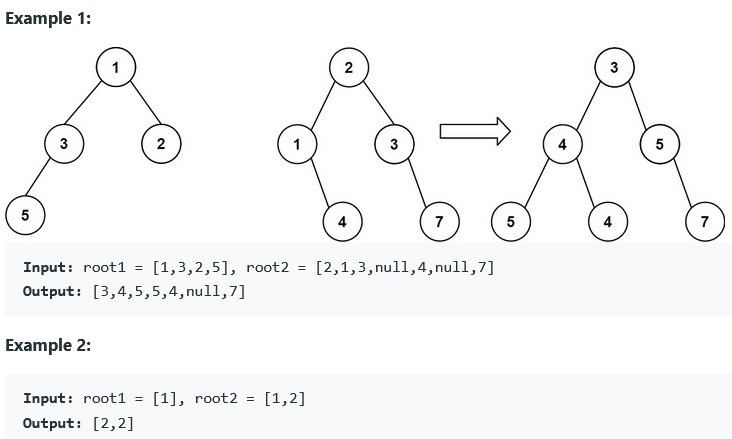

### REFERENCE
https://leetcode.com/problems/merge-two-binary-trees/

### task
You are given two binary trees root1 and root2.
Imagine that when you put one of them to cover the other, some nodes of the two trees are overlapped while the others are not. You need to merge the two trees into a new binary tree. The merge rule is that if two nodes overlap, then sum node values up as the new value of the merged node. Otherwise, the NOT null node will be used as the node of the new tree.
Return the merged tree.
Note: The merging process must start from the root nodes of both trees.

### Examples

### Constraints
* The number of nodes in both trees is in the range [0, 2000].
* -10^4 <= Node.val <= 10^4
